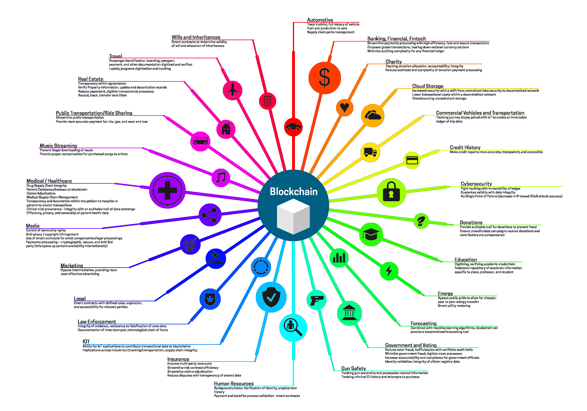

# Learn Blockchain Together

Curated collection of lists of useful mostly free resources to learn Blockchain together.

## Content

## Tags legend

- ( _course_ ) -- consists of series of text/video articles trying to give to a reader solid foundation
- ( _article_ ) -- either single article or single video-tutorial
- ( _reading_ ) -- material to read
- ( _video_ ) -- material to watch
- ( _interactive_ ) -- it is possible to interact and get feedback from the system
- ( _list_ ) -- list of resources
- ( _certificate_ ) -- certificate is available <!-- qqq : apply the tag to learn rust together resources -->
- ( _introductory_ ) -- introductory level <!-- qqq : apply the tag to learn rust together resources -->
- ( _advanced_ ) -- advanced level
- ( _introductory_ ) -- introductory level
- ( _non-technical_ ) -- non-technical explanation
- ( _technical_ ) -- technical explanation
- ( _theoretical_ ) -- theoretical
- ( _practical_ ) -- practical
- ( _non-eng_ ) -- non-english language
- ( _domain:uniswap_ ) -- related to uniswap
- ( _domain:cryptography_ ) -- about cryptography
- ( _domain:consensus_ ) -- consensus specific resources
- ( _python_ ) -- contains Python code
- ( _js_ ) -- contains JavaScript code
- ( _java_ ) -- contains Java code
- ( _go-lang_ ) -- contains Go code
- ( _framework_ ) -- material is related to certain framework
- ( _book_ ) -- a book

## General-purpose technical introductory courses

( _course_ ) ( _introductory_ ) ( _technical_ )

- :star: [Learn Blockhchain](https://www.youtube.com/playlist?list=PLyvfcZJ0pCaJyS3QDYm-P-aVc4ITd9ls1) by [TechnoDine](https://www.youtube.com/c/TechnoDine) ( _video_ ) ( _theoretical_ )
- :star: [Cryptography](https://www.practicalnetworking.net/series/cryptography/cryptography/) by [practicalnetworking.net](https://www.practicalnetworking.net/)  ( _reading_ ) ( _course_ ) ( _theoretical_ )
- [Cryptography Course](https://www.youtube.com/playlist?list=PLE4V3KXzxPRQYUil17HB6XcIu-JMebD7n) by [Julian Hosp](https://www.youtube.com/c/JulianHospEnglish) ( _video_ ) ( _theoretical_ )
- :star: [DeFi Programming Course](https://www.youtube.com/playlist?list=PLbbtODcOYIoGC8c5-gs0EYzpYVUPdmqO3) by [EatTheBlocks](https://www.youtube.com/c/EatTheBlocks) ( _video_ ) ( _practical_ )
- [Web3 Tutorial](https://www.youtube.com/playlist?list=PLbbtODcOYIoFs0PDlTdxpEsZiyDR2q9aA) by [EatTheBlocks](https://www.youtube.com/c/EatTheBlocks) ( _video_ ) ( _practical_ )
- [Solidity Tutorial](https://www.youtube.com/playlist?list=PLbbtODcOYIoE0D6fschNU4rqtGFRpk3ea) by [EatTheBlocks](https://www.youtube.com/c/EatTheBlocks) ( _video_ ) ( _practical_ )

## Courses with certification

( _video_ ) ( _reading_ ) ( _interactive_ ) ( _certificate_ ) ( _technical_ )

- [Intro to Information Security](https://www.udacity.com/course/intro-to-information-security--ud459) by [Georgia Tech](https://www.gatech.edu/)
- [Blockchain and Bitcoin Fundamentals](https://www.udemy.com/course/blockchain-and-bitcoin-fundamentals/) by [George Levy](https://www.udemy.com/course/blockchain-and-bitcoin-fundamentals/#instructor-1)
- [Blockchain Technology: A Guide To The Blockchain Ecosystem](https://www.udemy.com/course/blockchain/) by [Ravinder Deol](https://www.udemy.com/course/blockchain/#instructor-1)

## General-purpose non-technical introductory courses

( _course_ ) ( _introductory_ ) ( _non-technical_ )

- [Blockchain & Cryptocurrency](https://www.youtube.com/playlist?list=PLzvRQMJ9HDiQF_5bEErheiAawrJ-2zQoI) by [Simply Explained](https://www.youtube.com/c/Savjee) ( _video_ ) ( _theoretical_ )
- [Crypto](https://www.youtube.com/playlist?list=PLjrTIwaNiTwmsCrO38BWYVrQFCv9GJ1pt) by [Finematics](https://www.youtube.com/c/Finematics) ( _video_ ) ( _theoretical_ )
- [Learn Blockhchain](https://www.youtube.com/playlist?list=PLixm1arf_lEyKfbHakL7YNNpZNr7nzp2j) by [Lisk](https://www.youtube.com/c/LiskHQ) ( _video_ ) ( _theoretical_ )
- [Educational Guides](https://www.youtube.com/playlist?list=PLk1ALX7IOH_npyk1W_88gxTDpTEfZg_Og) by [Coin Bureau](https://www.youtube.com/c/CoinBureau) ( _video_ ) ( _non-technical_ )
- [The Complete Beginner's Crypto Crash Course](https://www.youtube.com/playlist?list=PLU52pNodXIGdM6XDgHVG7DsPytlsrR_6b) by [99Bitcoins](https://www.youtube.com/c/Bitcoinwithpaypal) ( _video_ ) ( _non-technical_ )
- [Blockchain & Crypto 101](https://www.youtube.com/playlist?list=PLIAO2T5dSfa225c8mTbPg3MIkhvk2ALgN) by [Binance Academy](https://www.youtube.com/c/BinanceAcademy) ( _video_ ) ( _non-technical_ )
- :star: [Blockchain career advice](https://www.youtube.com/playlist?list=PLbbtODcOYIoHRL3rH6JjqxaqcjQ0uwe9e) by [EatTheBlocks](https://www.youtube.com/c/EatTheBlocks) ( _video_ ) ( _practical_ )
- [Blockchain Технологии](https://www.youtube.com/playlist?list=PLMPkGmaSnfyqvwI0Up4uaq48UQ4mnzlPj) by [CryptoInside](https://www.youtube.com/c/CryptoInsideClub) ( _video_ ) ( _theoretical_ ) ( _non-eng_ )
- [Погружение в крипту за 7 дней](https://www.youtube.com/playlist?list=PLsJDzAldPQJSNRfN3RKEf4GDcpnDksnIP) by [Incrypted](https://www.youtube.com/c/Incryptednet) ( _video_ ) ( _non-technical_ )
- [Online-курс по Blockchain](https://www.youtube.com/watch?v=WBf8FZjPPqw&list=PLhZQuknA7yUBt82ow8rEfw_G8tNZjt3qB) by [Distributed Lab](https://www.youtube.com/channel/UCAKVZKVgINgKAwmAeyojMaw) ( _video_ ) ( _non-technical_ )
- [Курс по Блокчейн](https://www.youtube.com/watch?v=p1tWUCSQNf0&list=PLys0IdlMg6XdMv4sP3UyGBovR5WhQqaM4) by [МФТИ](https://www.youtube.com/channel/UCZ-sv20iKVXtQVR4epbmz8A) ( _video_ ) ( _non-technical_ ) ( _technical_ )
- [Blockchain and Money](https://ocw.mit.edu/courses/sloan-school-of-management/15-s12-blockchain-and-money-fall-2018/index.htm) by [MIT](https://ocw.mit.edu/) ( _video_ ) ( _non-technical_ )
- [Blockchain and Money - русская озвучка](https://www.youtube.com/watch?v=pZxp--SpWF8&list=PLDTlYmDW7oIgx1WrpkEAkrQVF-hvdConK) by [MIT - Cryptus](https://www.youtube.com/channel/UCGzOtu1tlrOeq_-jXzV-Fng) ( _video_ ) ( _non-technical_ ) ( _technical_ )

## Introductory articles

( _article_ ) ( _introductory_ )

- [But how does bitcoin actually work?](https://www.youtube.com/watch?v=bBC-nXj3Ng4) by [3Blue1Brown](https://www.youtube.com/channel/UCYO_jab_esuFRV4b17AJtAw) ( _video_ ) ( _technical_ )
- [Bitcoin for Beginners](https://www.youtube.com/watch?v=hXkiAfjFtgU) by [Ali Abdaal](https://www.youtube.com/channel/UCoOae5nYA7VqaXzerajD0lg) ( _video_ ) ( _non-technical_ )
- [WTF is The Blockchain?](https://hackernoon.com/wtf-is-the-blockchain-1da89ba19348) by [Mohit Mamoria](https://hackernoon.com/u/mohitmamoria) ( _reading_ ) ( _non-technical_ )
- [Blockchain for 2018 and Beyond: A (growing) list of blockchain use cases](https://medium.com/fluree/blockchain-for-2018-and-beyond-a-growing-list-of-blockchain-use-cases-37db7c19fb99) by [Kevin Doubleday](https://medium.com/@kdoubleday) ( _reading_ ) ( _non-technical_ )
- :star: [Learn Blockchain: The COMPLETE beginner’s guide](https://www.youtube.com/watch?v=99pYGpTWcXM) by [Dapp University](https://www.youtube.com/channel/UCY0xL8V6NzzFcwzHCgB8orQ) ( _video_ ) ( _technical_ ) ( _theoretical_ )
- :star: [Blockchain Tutorial for Beginners | Build a DeFi App](https://www.youtube.com/watch?v=CgXQC4dbGUE) by [Dapp University](https://www.youtube.com/channel/UCY0xL8V6NzzFcwzHCgB8orQ) ( _video_ ) ( _technical_ ) ( _practical_ )

## Build your own Blockchain

( _introductory_ )

- [How To Build Your Own Blockchain](https://bigishdata.com/2017/10/17/write-your-own-blockchain-part-1-creating-storing-syncing-displaying-mining-and-proving-work/) by [Jack Schultz](https://bigishdata.com/author/jackschultz23/) ( _reading_ ) ( _course_ ) ( _python_ )
- [Creating Your First Blockchain with Java]() by [Kass](https://medium.com/@cryptokass) ( _reading_ ) ( _course_ ) ( _java_ )
- [Learn Blockchains by Building One](https://hackernoon.com/learn-blockchains-by-building-one-117428612f46) by [Daniel van Flymen](https://hackernoon.com/u/dvf) ( _reading_ ) ( _article_ ) ( _python_ )
- [A Practical Introduction to Blockchain](http://adilmoujahid.com/posts/2018/03/intro-blockchain-bitcoin-python/) by [Adil Moujahid](http://adilmoujahid.com/) ( _reading_ ) ( _article_ ) ( _practical_ ) ( _python_ )
- [A blockchain in 200 lines of code](https://medium.com/@lhartikk/a-blockchain-in-200-lines-of-code-963cc1cc0e54) by [Lauri Hartikka](https://medium.com/@lhartikk) ( _reading_ ) ( _article_ ) ( _js_ )
- [Building a blockchain with Javascript](https://www.youtube.com/playlist?list=PLzvRQMJ9HDiTqZmbtFisdXFxul5k0F-Q4) by [Simply Explained](https://www.youtube.com/c/Savjee) ( _video_ ) ( _course_ ) ( _practical_ ) ( _js_ )
- [Code Your Own Cryptocurrency on Ethereum](https://www.youtube.com/playlist?list=PLS5SEs8ZftgWFuKg2wbm_0GLV0Tiy1R-n) by [Dapp University](https://www.youtube.com/c/DappUniversity) ( _video_ ) ( _course_ ) ( _practical_ )
- [Beginner Blockchain Tutorial For Developers](https://www.youtube.com/playlist?list=PLS5SEs8ZftgXDYtXZIhYBl18frMt2yWZW) by [Dapp University](https://www.youtube.com/c/DappUniversity) ( _video_ ) ( _course_ ) ( _practical_ )
- [Solidity for Beginners](https://www.youtube.com/playlist?list=PLS5SEs8ZftgUq-aMMYeKf8nPqHrNqa3Iu) by [Dapp University](https://www.youtube.com/c/DappUniversity) ( _video_ ) ( _course_ ) ( _practical_ )
- [Blockchain Developer Tutorials](https://www.youtube.com/playlist?list=PLS5SEs8ZftgUTXs0OJD2LFpYBPr4L54id) by [Dapp University](https://www.youtube.com/c/DappUniversity) ( _video_ ) ( _course_ ) ( _practical_ )
- [Building Blockchain in Go](https://github.com/Jeiwan/blockchain_go) by [Ivan Kuznetsov](https://github.com/jeiwan) ( _reading_ ) ( _course_ ) ( _practical_ ) ( _go-lang_ )

<!-- ## Consensus

( _domain:consensus_ )

- [Bitcoin - Proof of work](https://www.youtube.com/watch?v=9V1bipPkCTU) by [Khan Academy](https://www.youtube.com/c/khanacademy) ( _video_ ) ( _article_ ) -->

## Cryptography

( _domain:cryptography_ )

- :star: [Cryptography](https://www.practicalnetworking.net/series/cryptography/cryptography/) by [practicalnetworking.net](https://www.practicalnetworking.net/)  ( _reading_ ) ( _course_ ) ( _introductory_ ) ( _technical_ )
- [Cryptography Course](https://www.youtube.com/playlist?list=PLE4V3KXzxPRQYUil17HB6XcIu-JMebD7n) by [Julian Hosp](https://www.youtube.com/c/JulianHospEnglish) ( _video_ ) ( _course_ ) ( _introductory_ ) ( _technical_ )
- [Introduction to Cryptography](https://www.youtube.com/channel/UC1usFRN4LCMcfIV7UjHNuQg/featured) by [Christof Paar](https://www.emsec.ruhr-uni-bochum.de/chair/_staff/christof-paar/) ( _video_ ) ( _course_ ) ( _introductory_ ) ( _technical_ )

<!-- - [Bitcoin - Cryptographic hash function](https://www.youtube.com/watch?v=0WiTaBI82Mc) by [Khan Academy](https://www.youtube.com/c/khanacademy) ( _video_ ) ( _article_ ) ( _introductory_ ) qqq : ? -->

## Books

( _book_ ) ( _reading_ )

- [Attack of the 50 Foot Blockchain: Bitcoin, Blockchain, Ethereum & Smart Contracts](https://davidgerard.co.uk/blockchain/table-of-contents/) by [David Gerard](https://davidgerard.co.uk/) :blue_book:
- [Mastering Bitcoin - Programming the Open Blockchain](https://github.com/bitcoinbook/bitcoinbook/blob/develop/ch09.asciidoc) by [Andreas M. Antonopoulos](https://github.com/bitcoinbook/) :blue_book:
- [Programming Blockchains in Ruby from Scratch Step-by-Step Starting w/ Crypto Hashes... ](https://github.com/yukimotopress/programming-blockchains-step-by-step) by [Gerald Bauer](https://github.com/geraldb) :blue_book:
- [Programming Cryptocurrencies and Blockchains in Ruby ( Beta / Rough Draft )](http://yukimotopress.github.io/blockchains) by [Gerald Bauer](https://github.com/geraldb) :blue_book:
- [Blockchain for Dummies, IBM Limited Edition](https://www.ibm.com/blockchain/what-is-blockchain.html) by [Manav Gupta](https://twitter.com/g_manav) :blue_book:
- [Mastering Ethereum - Building Contract Services and Decentralized Apps on the Blockchain](https://github.com/ethereumbook/ethereumbook) by [Andreas M. Antonopoulos](https://ethereumbook.info/) :blue_book:
- [Building Decentralized Apps on the Ethereum Blockchain](https://www.manning.com/books/building-ethereum-dapps) by [Roberto Infante](https://www.amazon.com/Roberto-Infante/e/B07PG576SR%3Fref=dbs_a_mng_rwt_scns_share) :blue_book:
- [Blockchain in Action](https://www.manning.com/books/blockchain-in-action) by [Bina Ramamurthy](https://www.amazon.com/Bina-Ramamurthy/e/B08JQN7FDH%3Fref=dbs_a_mng_rwt_scns_share) :blue_book:
- [Permissioned Blockchains in Action](https://livebook.manning.com/book/permissioned-blockchains-in-action/welcome/v-6/) by [Mansoor Ahmed-Rengers](https://github.com/Mansoor-AR) :blue_book:
- [Programming Hyperledger Fabric](https://www.amazon.com/dp/0578802228) by [Siddharth Jain](https://www.amazon.com/s/ref=dp_byline_sr_book_1?ie=UTF8&field-author=SIDDHARTH+JAIN&text=SIDDHARTH+JAIN&sort=relevancerank&search-alias=books) :blue_book:

<!-- ## Uniswap

( _domain:uniswap_ )

- [Uniswap V3 is COMING](https://www.youtube.com/watch?v=4CJEGVBcPGQ) by [Erik Zivkovic](https://www.youtube.com/channel/UCqK_GSMbpiV8spgD3ZGloSw) ( _vide_ ) ( _article_ ) -->

## Lists

( _list_ )

- [Curated list of resources for the development and applications of block chain](https://github.com/yjjnls/awesome-blockchain) by [yjjnls](https://github.com/yjjnls)
- [A Curated List of Blockchain and General Cryptocurrency Resources](https://github.com/coderplex-org/awesome-blockchain) by [Coderplex Foundation](https://github.com/coderplex-org)
- [Awesome Blockchain for Developers](https://github.com/Jeiwan/awesome-blockchain) by [Jeiwan](https://github.com/Jeiwan)
- [A collection about awesome blockchains - open distributed databases w/ crypto hashes incl. git](https://github.com/openblockchains/awesome-blockchains) by [Jeiwan](https://github.com/openblockchains)
- [Blockchain Learning Path](https://github.com/protofire/blockchain-learning-path) by [ProtoFire](https://github.com/protofire)
- [A curated list of Blockchain and Cryptocurrency Technologies visualisation](https://github.com/xpfio/awesome-blockchain-visualisation) by [xpfio](https://github.com/xpfio)
- [Curated list of blockchain services, especially focused on decentralized exchange protocol](https://github.com/hitripod/awesome-blockchain) by [Kordan Ou](https://github.com/hitripod/)
- [A list of crypto readings and resources](https://a16z.com/2018/02/10/crypto-readings-resources/) by [a16z](https://a16z.com/)
- [Blockchain and Identity](https://github.com/peacekeeper/blockchain-identity) by [Markus Sabadello](https://github.com/peacekeeper/)
- [Awesome Non-Financial Blockchain](https://github.com/machinomy/awesome-non-financial-blockchain) by [Machinomy](https://github.com/machinomy)
- [Awesome Blockchain Books](https://github.com/BlockchainBooks/blockchainbooks.github.io) by [Shubham Tatvamasi](https://github.com/ShubhamTatvamasi) :blue_book: ( _book_ )
<!-- - [Awesome Substrate](https://github.com/substrate-developer-hub/awesome-substrate#readme) by [Substrate Developer Hub](https://github.com/substrate-developer-hub) ( _framework_ ) qqq : ? -->